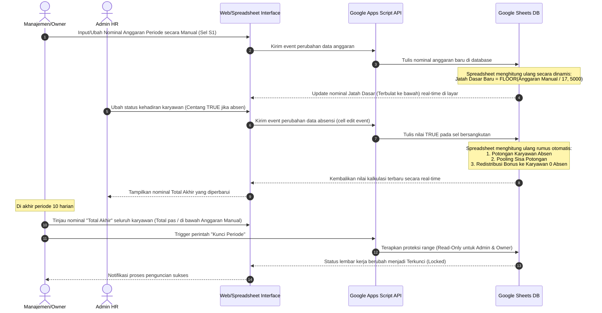
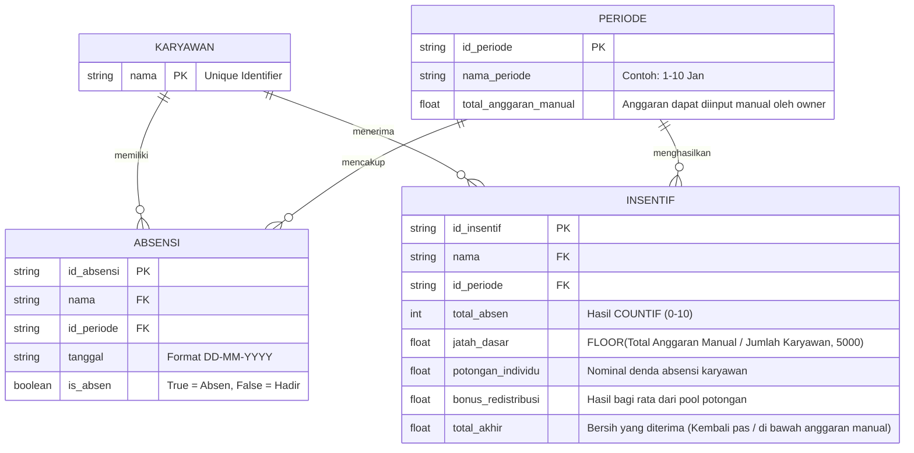

# PRD — Project Requirements Document

## 1. Overview
Sistem Manajemen Absensi & Kalkulasi Insentif Karyawan adalah platform berbasis spreadsheet-as-a-database yang dirancang untuk mengotomatisasi pencatatan kehadiran harian karyawan serta mengkalkulasi insentif keuangan secara real-time per periode 10 harian (siklus desade, contoh: tanggal 1-10, 11-20, 21-30/31).

Sistem ini menerapkan **Metode Pooling & Redistribusi Potongan Berkeadilan** untuk **17 karyawan terdaftar**: Anto, Berry, Bocil, Davit, Dede, Doyok, Ega, Fadil, Farid, Gugun, Rahmen, Otam, Alvian, Riski, Ari, Ariel, dan Iket.

Dalam sistem ini, **total anggaran insentif bersifat fleksibel (bisa diubah secara manual)** pada setiap awal periode oleh manajemen. Setiap potongan denda akibat ketidakhadiran karyawan tidak dikembalikan ke kas perusahaan, melainkan dikumpulkan ke dalam satu wadah (*pool*) lalu didistribusikan secara merata sebagai bonus tambahan kepada karyawan yang memiliki catatan **kehadiran penuh (0 hari absen)** selama periode desade tersebut. 

Untuk menghindari nominal desimal pecahan rupiah yang menyulitkan pembagian dan pembayaran, sistem menerapkan aturan **pembulatan ke bawah (Floor) ke kelipatan Rp 5.000 terdekat** pada kalkulasi Jatah Dasar karyawan. Selisih dari pembulatan tersebut akan tetap aman tersimpan di kas perusahaan sebagai efisiensi anggaran operasional.

### Target Pengguna (User Personas)
1. **Admin HR / Operasional**: Bertanggung jawab untuk mengisi presensi harian karyawan (hadir/absen).
2. **Manajemen / Pemilik Perusahaan**: Bertanggung jawab untuk menentukan dan memasukkan anggaran secara manual per periode, memverifikasi rekapitulasi akhir, dan menyetujui pencairan insentif.
3. **17 Karyawan (Viewer)**: Membutuhkan transparansi atas rincian potongan absensi dan jumlah akhir insentif yang diterima.

### Masalah yang Ingin Dipecahkan
* Proses rekapitulasi manual absensi yang memakan waktu dan rentan salah ketik di akhir periode 10 harian.
* Kebutuhan penyesuaian anggaran yang fleksibel (tidak kaku di satu angka) di mana manajemen bisa mengubah nominal total dana kapan saja secara manual sesuai performa bisnis.
* Masalah nominal desimal pecahan rupiah (misal Rp 26.412) yang tidak praktis untuk didistribusikan.
* Rumitnya kalkulasi redistribusi sisa potongan keuangan secara manual ke karyawan yang rajin ketika nominal anggaran awal berubah.
* Perlunya penegakan aturan disiplin yang adil, di mana karyawan yang tidak masuk penuh (10 hari) tidak berhak menerima sisa insentif apa pun (Rp 0), dan seluruh jatah dasarnya dialihkan untuk bonus karyawan berkinerja penuh.

---

## 2. Requirements

### Functional Requirements
| ID | Deskripsi Kebutuhan | Aturan Bisnis / Spesifikasi |
| :--- | :--- | :--- |
| **FR-01** | Input Presensi Harian | Admin dapat mencentang status absensi harian karyawan menggunakan tipe data Boolean (`True` = Absen/Tidak Hadir, `False` = Hadir/Masuk) pada siklus tanggal aktif. |
| **FR-02** | Perhitungan Total Absen | Sistem menghitung otomatis jumlah ketidakhadiran (`True`) selama rentang periode 10 hari menggunakan formula `=COUNTIF(Range_Tanggal, TRUE)`. |
| **FR-03** | Input Anggaran Manual & Fleksibel | Manajemen dapat mengedit atau memasukkan nominal total anggaran berjalan secara manual pada kolom kontrol khusus (misal: Rp 300.000, Rp 500.000, dst.) kapan saja tanpa merusak sistem formula. |
| **FR-04** | Kalkulasi Jatah Dasar dengan Pembulatan | Jatah dasar dihitung dari anggaran dibagi total karyawan, lalu **dibulatkan ke bawah ke kelipatan Rp 5.000 terdekat**.  *Rumus konseptual:* `FLOOR(Total_Anggaran_Manual / Jumlah_Karyawan, 5000)`.  *Contoh:* Rp 26.412 dibulatkan menjadi Rp 25.000. Selisih pembulatan tetap di kas perusahaan. |
| **FR-05** | Penghitungan Potongan Individu | * Jika `Total_Absen` < 10 hari, potongan = `Total_Absen * Rp 10.000` (maksimal denda potongan Rp 100.000). * Jika `Total_Absen` = 10 hari (absen penuh), maka seluruh `Jatah_Dasar` yang telah dibulatkan tersebut dipotong habis (100% dipotong) untuk dialihkan ke pool bonus. |
| **FR-06** | Sistem Pooling & Redistribusi Bonus | * Seluruh potongan individu dikumpulkan menjadi satu variabel `Total_Sisa_Potongan`. * `Total_Sisa_Potongan` dibagi rata kepada semua karyawan yang memiliki `Total_Absen = 0` (hadir penuh). * Jika tidak ada karyawan yang hadir penuh, sisa potongan tidak diredistribusikan (ditahan sebagai efisiensi anggaran perusahaan). |
| **FR-07** | Kalkulasi Total Akhir | Nominal bersih yang diterima karyawan. Rumus: * Absen 10 Hari: **Rp 0** * Absen 1-9 Hari: `Jatah_Dasar - Potongan_Individu` * Absen 0 Hari (Hadir Penuh): `Jatah_Dasar + Bonus_Redistribusi` |
| **FR-08** | Pembatasan Hak Akses | Melakukan proteksi pada kolom-kolom yang berisi formula agar tidak bisa dimodifikasi oleh pengguna tanpa otorisasi tingkat tinggi, sementara kolom anggaran manual tetap dapat diakses oleh Manajemen/Owner. |

### Non-Functional Requirements
| Atribut | Kebutuhan Spesifik |
| :--- | :--- |
| **Performance** | Kalkulasi seluruh formula pembulatan, pooling, dan redistribusi pada lembar kerja (Spreadsheet) harus diselesaikan secara instan (< 1 detik setelah nominal anggaran manual diubah). |
| **Security** | Pembatasan akses berbasis peran (Role-Based Access Control) menggunakan integrasi Google Workspace Account. Hanya Owner yang dapat mengedit sel Anggaran Manual dan sel formula terkunci. |
| **Reliability** | Memanfaatkan infrastruktur Google Cloud Platform (Google Sheets) yang menjamin ketersediaan tinggi (Uptime SLA 99.9%). |
| **Scalability** | Struktur formula harus dinamis agar jika terjadi penambahan/pengurangan jumlah karyawan atau perubahan anggaran secara drastis, pembagian rata *budget pool* tetap akurat tanpa merusak formula. |

---

## 3. Core Features

| ID Fitur | Nama Fitur | Deskripsi Fitur | Prioritas | Estimasi Kompleksitas |
| :--- | :--- | :--- | :--- | :--- |
| **FEAT-01** | *Dynamic Grid Checklist* | Tabel interaktif berisi daftar 17 nama karyawan dan kolom tanggal siklus 10-hari (1-10, 11-20, 21-30/31) dalam bentuk *checkbox* Boolean. | High | Low |
| **FEAT-02** | *Manual Budget Control Panel* | Input field khusus yang memungkinkan Manajemen mengubah total anggaran insentif kapan saja. | High | Low |
| **FEAT-03** | *Real-time Adaptive & Rounding Engine* | Logika formula tersentralisasi dengan pembulatan ke bawah kelipatan 5.000 (`FLOOR`) yang secara dinamis menghitung *Jatah Dasar*, *Potongan*, *Pooling Sisa*, dan *Bonus* berdasarkan total anggaran yang diinput secara manual. | High | High |
| **FEAT-04** | *Range Protection Guard* | Fitur keamanan internal untuk mengunci sel formula dan hanya mengizinkan pengisian pada area tanggal aktif dan kolom anggaran manual. | High | Low |
| **FEAT-05** | *Export & PDF Generator* | Fitur pencetakan laporan slip insentif 10 harian per karyawan ke format PDF atau cetak fisik. | Medium | Medium |

---

## 4. User Flow

1. **Akses Sistem**: Admin dan Manajemen membuka lembar Spreadsheet utama.
2. **Setup Anggaran Manual**: Manajemen memasukkan nominal total anggaran untuk periode desade berjalan secara manual (contoh: `Rp 300.000` atau nominal lain) di sel acuan khusus (`S1`). Sistem secara otomatis membagi anggaran tersebut dengan jumlah karyawan, lalu membulatkannya ke bawah menggunakan fungsi `FLOOR` ke kelipatan Rp 5.000 terdekat untuk menjadi Jatah Dasar baru 17 karyawan.
3. **Pencatatan Kehadiran Harian**:
   * Setiap hari kerja dalam siklus 10 harian (misal Tanggal 1 s/d 10), Admin memeriksa kehadiran fisik 17 karyawan (Anto s/d Iket).
   * Jika ada karyawan yang absen, Admin memberikan tanda centang pada kolom tanggal bersangkutan (`True`). Jika hadir, dibiarkan kosong (`False`).
4. **Kalkulasi Pooling & Pembagian Bonus Adaptif (Otomatis)**:
   * Rumus langsung menghitung total hari absen setiap karyawan.
   * Sistem menghitung potongan masing-masing karyawan yang absen berdasarkan Jatah Dasar terbulat yang bersumber dari anggaran dinamis tersebut.
   * Sistem menjumlahkan semua potongan tersebut ke dalam satu wadah saldo (`Total_Sisa_Potongan`).
   * **Redistribusi**: Sistem membagi `Total_Sisa_Potongan` dengan `Jumlah_Karyawan_Hadir_Penuh`, lalu menambahkannya ke `Jatah_Dasar` masing-masing karyawan yang hadir penuh (0 hari absen).
5. **Verifikasi Akhir**: Di hari ke-10 (akhir siklus), Manajemen membuka berkas, meninjau kolom `Total_Akhir` (memastikan total pengeluaran aman dan tidak melebihi anggaran yang dimasukkan di awal), menyetujui pembayaran, lalu mengunci lembar kerja tersebut.

---

## 5. Architecture

Sistem ini dirancang menggunakan arsitektur **Serverless Client-Spreadsheet** yang sangat efisien dalam hal biaya dan pemeliharaan:
* **Client Layer**: Antarmuka berbasis Web (Google Sheets UI atau Custom Web App menggunakan Tailwind/React) yang berinteraksi langsung dengan pengguna.
* **Logic/Middleware Layer**: Google Apps Script (GAS) bertindak sebagai backend engine untuk memproses otorisasi, validasi data, pembatasan hak akses, serta penyiapan laporan otomatis.
* **Database Layer**: Google Sheets bertindak sebagai Database Relasional Terstruktur (flat-table schema) dengan kemampuan komputasi bawaan (*built-in calculation engine*).

---

## 6. Sequence Diagram

---

## 7. Database Schema

Meskipun diimplementasikan pada flat spreadsheet, secara konseptual data direlasikan sebagai berikut:

### Rancangan Detail Kolom Spreadsheet (Flat-Table Mapping)

Berikut adalah cetak biru pemetaan sel pada **Google Sheets** untuk **17 Karyawan**. Rentang data baris berada pada baris **2 hingga 18**.

#### A. Variabel Global (Panel Kontrol Admin & Owner)
Variabel ini diletakkan di sisi kanan luar tabel utama (misal pada Kolom `S`) agar mudah diawasi dan fleksibel untuk diedit:
* **Sel `S1`**: `300000` *(INPUT MANUAL - Nominal total anggaran dinamis dari Owner, bisa diganti angka berapa saja kapan pun)*
* **Sel `S2`**: `=COUNTA(A2:A18)` *(Jumlah Karyawan Terdaftar secara Dinamis, Menghasilkan: 17)*
* **Sel `S3`**: `=SUM(N2:N18)` *(Total Sisa Potongan dari seluruh karyawan yang terkumpul)*
* **Sel `S4`**: `=COUNTIF(L2:L18, 0)` *(Jumlah Karyawan dengan Kehadiran Penuh / 0 Absen)*

#### B. Struktur Kolom per Baris Karyawan (Baris 2 s/d 18)
* **Kolom `A` (Nama Karyawan)**:
  * Baris 2: `Anto` | Baris 3: `Berry` | Baris 4: `Bocil` | Baris 5: `Davit` | Baris 6: `Dede` | Baris 7: `Doyok` | Baris 8: `Ega` | Baris 9: `Fadil` | Baris 10: `Farid` | Baris 11: `Gugun` | Baris 12: `Rahmen` | Baris 13: `Otam` | Baris 14: `Alvian` | Baris 15: `Riski` | Baris 16: `Ari` | Baris 17: `Ariel` | Baris 18: `Iket`

* **Kolom `B` s/d `K` (Checkbox Tanggal Siklus)**:
  * Merepresentasikan hari ke-1 hingga hari ke-10 (Tanggal 1-10, 11-20, atau 21-30/31). Diisi dengan checkbox Boolean (`TRUE` jika dicentang/absen, `FALSE` jika kosong/hadir).

* **Kolom `L` (Total Absen)**:
  * Rumus (Baris 2): `=COUNTIF(B2:K2, TRUE)` *(Diterapkan hingga baris 18)*

* **Kolom `M` (Jatah Dasar dengan Pembulatan FLOOR 5000)**:
  * Rumus (Baris 2): `=FLOOR($S$1 / $S$2, 5000)` 
  * *Penjelasan:* Membagi nominal Anggaran Manual di `S1` dengan jumlah karyawan di `S2`, lalu membulatkannya ke bawah ke kelipatan Rp 5.000 terdekat. 
  * *Simulasi Angka:*
    * Jika anggaran = `Rp 300.000`, maka `300.000 / 17 = 17.647` -> Dibulatkan ke bawah menjadi **Rp 15.000**.
    * Jika anggaran = `Rp 450.000`, maka `450.000 / 17 = 26.470` -> Dibulatkan ke bawah menjadi **Rp 25.000**.

* **Kolom `N` (Potongan Individu)**:
  * Rumus (Baris 2): `=IF(L2=10, M2, MIN(L2*10000, 100000))`
  * *Penjelasan:* Jika absen 10 hari penuh (`L2=10`), potongan langsung sebesar Jatah Dasar hasil pembulatan yang berlaku saat itu (`M2`). Jika absen di bawah itu, potongan adalah Rp 10.000 per hari absen dengan batas maksimal Rp 100.000.

* **Kolom `O` (Bonus Redistribusi)**:
  * Rumus (Baris 2): `=IF(L2=0, IF($S$4>0, $S$3/$S$4, 0), 0)`
  * *Penjelasan:* Jika karyawan rajin (Absen = 0), ia mendapatkan jatah bonus dari hasil bagi `Sisa Potongan (S3) / Karyawan Rajin (S4)`. Menggunakan pengaman `IF($S$4>0, ...)` agar tidak terjadi error `#DIV/0!` jika tidak ada karyawan yang hadir penuh.

* **Kolom `P` (Total Akhir)**:
  * Rumus (Baris 2): `=IF(L2=10, 0, M2 - N2 + O2)`
  * *Penjelasan:* 
    1. Jika karyawan absen penuh 10 hari (`L2=10`), langsung dipaksa mendapatkan **Rp 0** secara absolut.
    2. Jika karyawan absen antara 1-9 hari, ia menerima `Jatah Dasar - Potongan Individu`.
    3. Jika karyawan hadir penuh 10 hari, ia menerima `Jatah Dasar + Bonus Redistribusi` (karena potongan `N2 = 0`).

---

## 8. Tech Stack

Untuk mengimplementasikan sistem ini dengan efisien, responsif, dan tanpa biaya lisensi yang besar, berikut adalah rekomendasi tumpukan teknologi yang digunakan:

* **Frontend (Antarmuka Pengguna)**:
  * *Pilihan Utama*: Google Sheets Native UI (Sangat cepat diimplementasikan, tanpa biaya hosting, ramah pengguna, mendukung checkbox instan dan pengeditan manual sel anggaran `S1` yang intuitif).
  * *Pilihan Alternatif*: React.js (Vite) + Tailwind CSS + AppSheet (Bila membutuhkan tampilan seluler yang lebih terstruktur dengan form input anggaran khusus).
* **Backend (Logika & API)**:
  * Google Apps Script (GAS) untuk menjembatani otomasi penguncian baris, pengiriman email slip gaji, dan backup data terjadwal.
* **Database**:
  * Google Sheets (Spreadsheet Engine) sebagai database relasional flat dengan komputasi realtime terintegrasi.
* **Integrasi & Otomasi**:
  * Google Drive API & Google Sheets API v4.
  * PDF Service bawaan Google Apps Script untuk konversi slip keuangan secara otomatis.